# ⚡ FitSport (Astrix) — Athlete Tracking & Performance Platform

[](https://nodejs.org)
[](#-tech-stack)
[](#-tech-stack)
[](https://t.me/sgifesdf_bot)
[](package.json)

**FitSport (Astrix)** is an intelligent athletic training, sports performance, nutrition, hydration, and recovery platform built for athletes, coaches, and sports enthusiasts. It combines sport-specific workload tracking, micro & macro-nutrient logging, dynamic musculoskeletal fatigue mapping, automated Telegram reporting, and unified performance analytics into a responsive dark-mode web application.

---

<div align="center">
  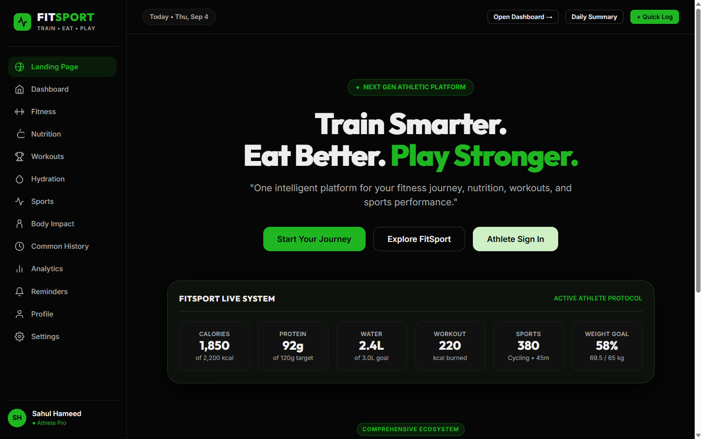
  <p><em>FitSport Platform Landing Screen — Train Smarter. Eat Better. Play Stronger.</em></p>
</div>

---

## 📑 Table of Contents

- [Visual Showcase & Prototype Screens](#-visual-showcase--prototype-screens)
  - [1. Landing Page](#1-landing-page)
  - [2. Unified Dashboard](#2-unified-dashboard)
  - [3. Fitness & Conditioning Hub](#3-fitness--conditioning-hub)
  - [4. Metabolic Nutrition Tracker](#4-metabolic-nutrition-tracker)
  - [5. Workouts & Drills](#5-workouts--drills)
  - [6. Cellular Hydration Tracker](#6-cellular-hydration-tracker)
  - [7. Sports Disciplines & Workload](#7-sports-disciplines--workload)
  - [8. Interactive Body Impact Map](#8-interactive-body-impact-map)
  - [9. Common History & Telegram Dispatches](#9-common-history--telegram-dispatches)
  - [10. Data-Driven Analytics](#10-data-driven-analytics)
  - [11. Daily Routine & Alarms](#11-daily-routine--alarms)
  - [12. Daily Performance Summary](#12-daily-performance-summary)
  - [13. Athlete Profile & Target Journey](#13-athlete-profile--target-journey)
  - [14. Platform Settings & Data Controls](#14-platform-settings--data-controls)
- [Key Features](#-key-features)
- [Module Highlights](#-module-highlights)
- [Tech Stack](#-tech-stack)
- [Project Architecture & File Layout](#-project-architecture--file-layout)
- [Getting Started](#-getting-started)
  - [Prerequisites](#prerequisites)
  - [Running the Local Server](#running-the-local-server)
- [REST API Reference](#-rest-api-reference)
- [Telegram Bot Automation](#-telegram-bot-automation)
- [Deployment](#-deployment)
- [License](#-license)

---

## 📸 Visual Showcase & Prototype Screens

### 1. Landing Page
The hero presentation of the FitSport ecosystem with core philosophy, active athlete indicators, and immediate access to dashboard and authentication.


---

### 2. Unified Dashboard
Live athletic command center showcasing calories consumed vs burned, protein intake, daily hydration level, active sports metrics, and progress toward the target weight.

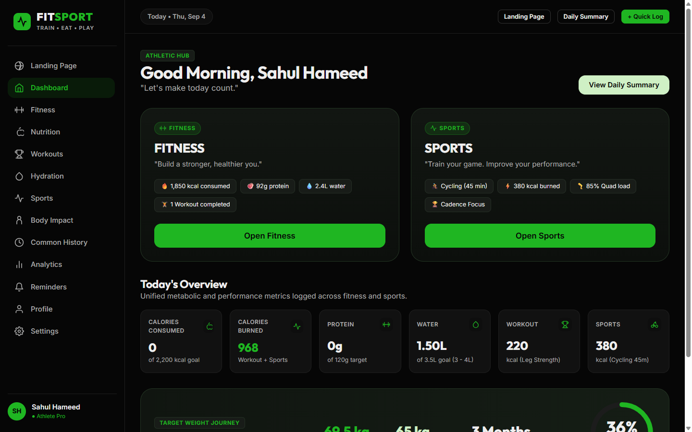

---

### 3. Fitness & Conditioning Hub
Dedicated fitness section connecting workout routines, daily meal totals, hydration reminders, and athlete conditioning milestones.

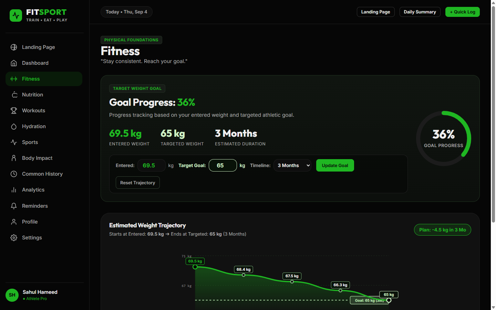

---

### 4. Metabolic Nutrition Tracker
Gram-precise macronutrient and micronutrient tracking (Calories, Protein, Carbohydrates, Fat, Iron, Fiber) with meal categorizations for Breakfast, Lunch, Dinner, and Snacks.

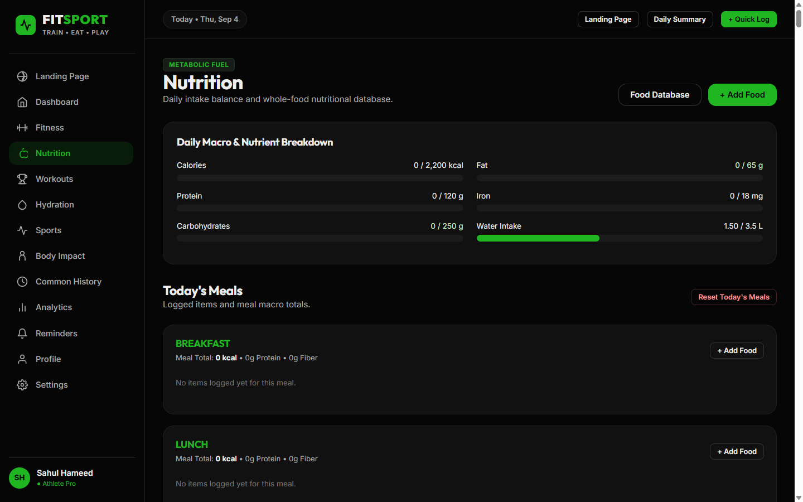

---

### 5. Workouts & Drills
Comprehensive training library split into **Home Bodyweight Workouts** (no equipment) and **Equipment Progression** (Dumbbells & Barbells) across Beginner and Advanced tiers.

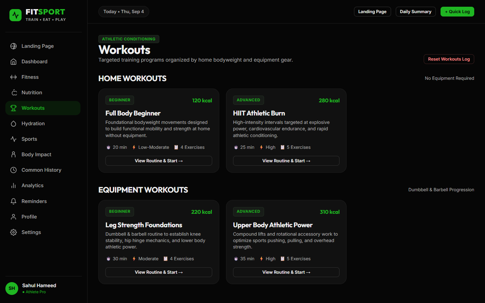

---

### 6. Cellular Hydration Tracker
Real-time hydration logger with radial goal visualization, fluid target ranges (3.0L - 4.0L), quick-add buttons (+250ml, +500ml, +1,000ml), and intake timeline.

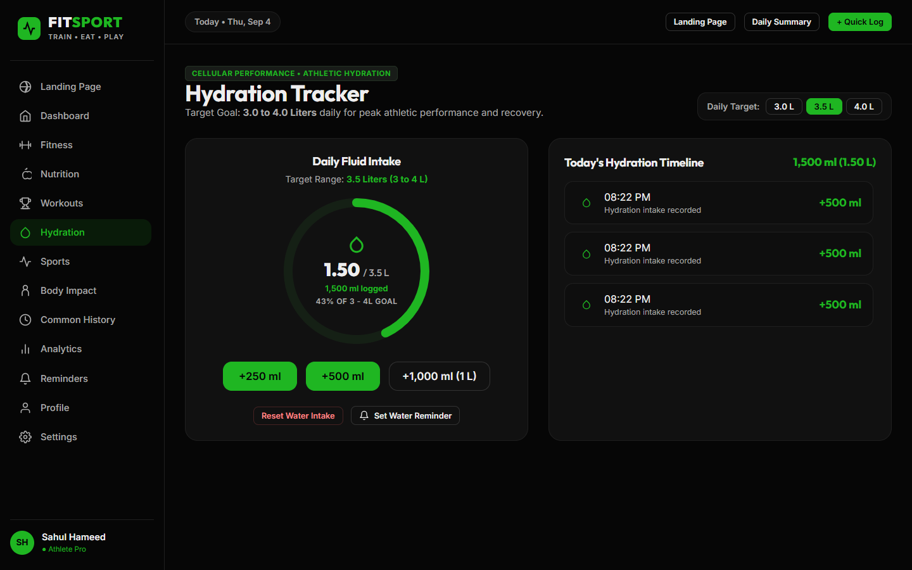

---

### 7. Sports Disciplines & Workload
Dedicated sports engine calculating estimated calorie burn and cardiovascular impact for **Cycling, Running, Football, Cricket, Badminton, Basketball, Swimming, and Tennis**.

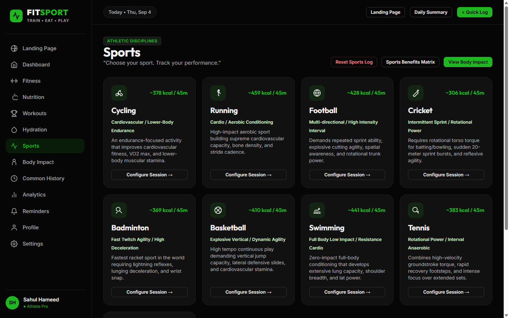

---

### 8. Interactive Body Impact Map
Interactive anatomical SVG body map illustrating musculoskeletal load distribution, anterior/posterior muscle activations, primary drivers, and secondary stabilizers.

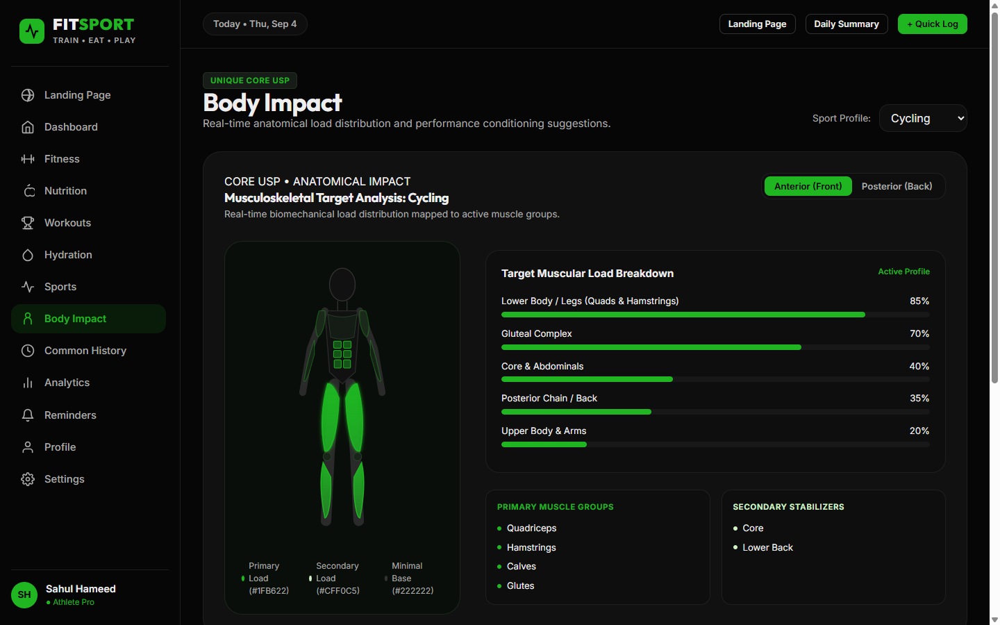

---

### 9. Common History & Telegram Dispatches
Unified chronological timeline aggregating events across all trackers. Includes direct **Send History to Telegram (@sgifesdf_bot)** and automated scheduled evening dispatches.

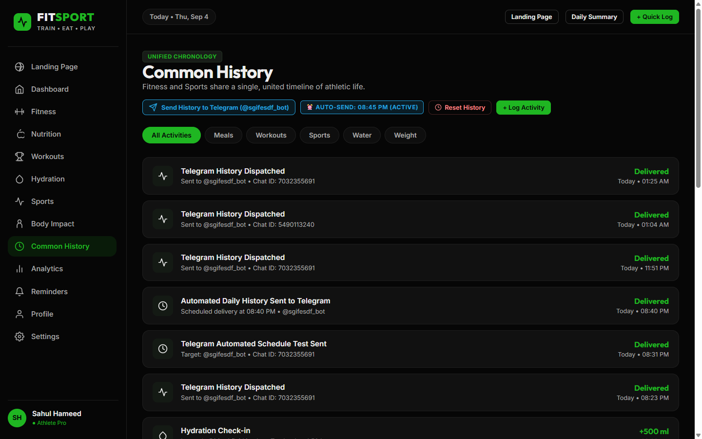

---

### 10. Data-Driven Analytics
Multi-metric analytics interface displaying sports discipline distribution, total training hours, cumulative calories burned, and weekly energy balance.

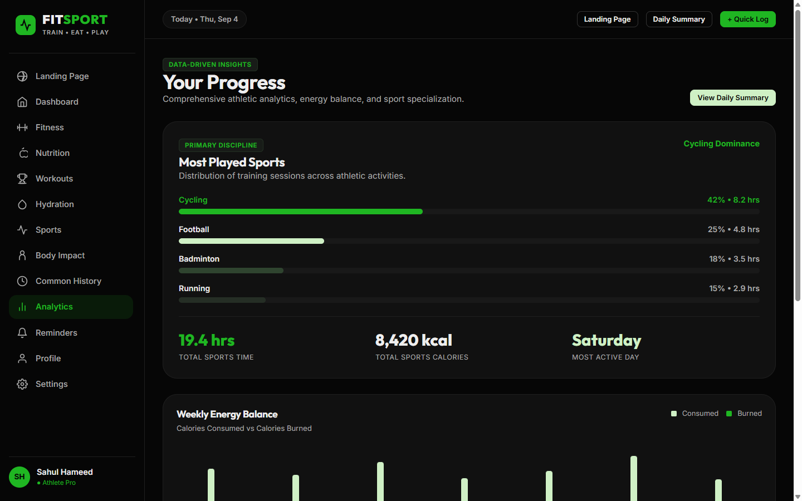

---

### 11. Daily Routine & Alarms
Intelligent alarm notification system for meals, hydration check-ins, workouts, and sports sessions with live system clock and custom tone tester.

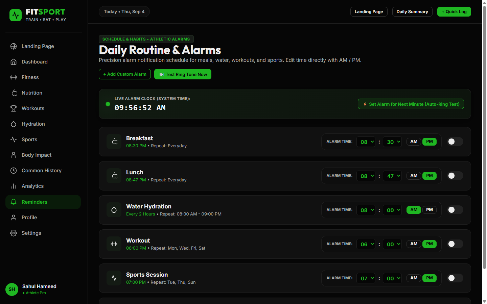

---

### 12. Daily Performance Summary
Comprehensive end-of-day athlete report summarizing metabolic intake, active burned calories, and one-click formatted export for **WhatsApp Sharing**.

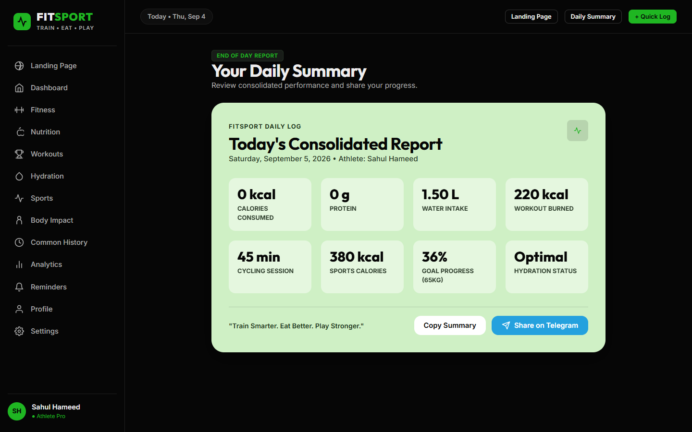

---

### 13. Athlete Profile & Target Journey
Personalized biometric dashboard displaying height, starting weight, current weight, target weight, timeline duration, and calculated BMI with health recommendations.

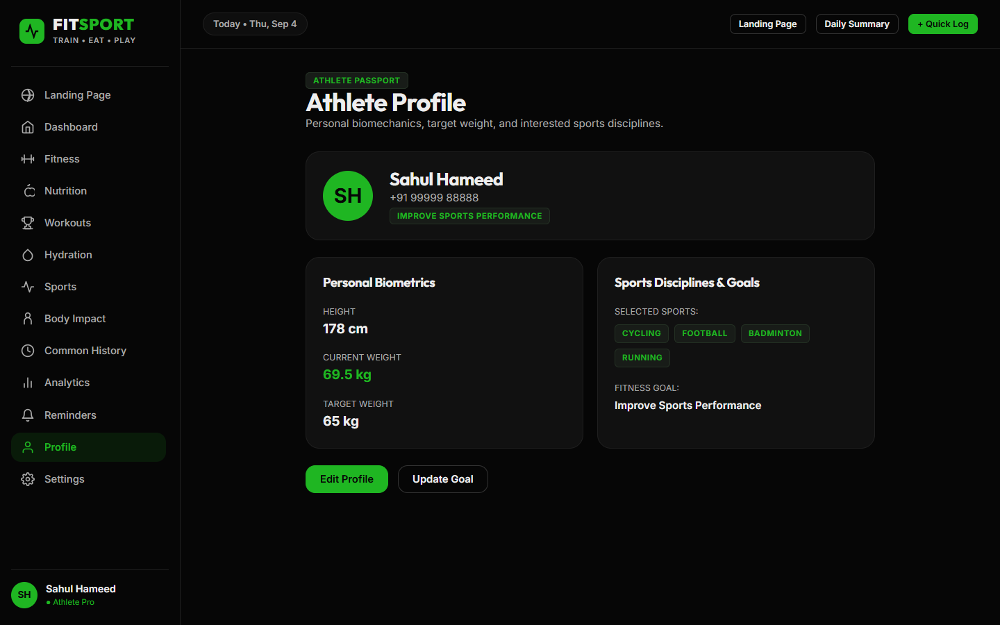

---

### 14. Platform Settings & Data Controls
System preferences, automated notification toggles, bot configuration, audio volume controls, and granular reset actions (daily, hydration, workouts, meals, or factory reset).

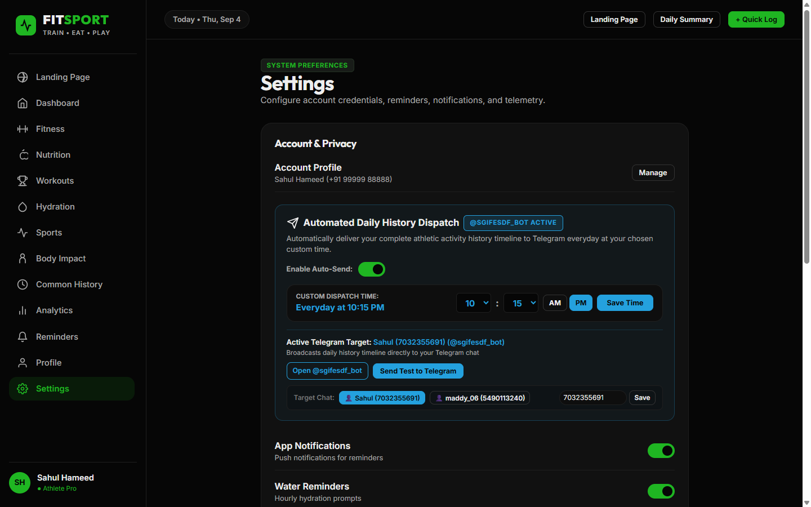

---

## 🚀 Key Features

- **⚡ Unified Performance Dashboard**: Real-time summary of daily caloric burn, consumed macros, hydration percentages, and active training sessions.
- **🥗 Sports Nutrition & Macro Tracking**: Searchable multi-category food dataset (proteins, grains, fruits, supplements) with gram-based macro and micronutrient calculation.
- **🏋️ Workouts Engine**: Pre-built workouts categorized by equipment availability (Calisthenics / Home vs. Gym Equipment) and intensity (Beginner, Intermediate, Advanced).
- **💧 Smart Hydration Logger**: Real-time intake tracking (+250ml, +500ml, +1000ml quick actions) with goal progress visualization.
- **⚽ Sport-Specific Analytics**: Workload and calorie computation for 8 distinct sports disciplines.
- **🧬 Interactive SVG Muscle Body Map**: Visual anterior & posterior muscle activation and fatigue state indicators based on logged training.
- **⏱️ Unified Common History**: Central chronological timeline capturing meals, workouts, water intake, sports sessions, and alerts in one view.
- **🤖 Automated Telegram Dispatches**: Bot integration (`@sgifesdf_bot`) capable of sending instant activity alerts or scheduled daily digests (e.g. 08:30 PM recap).
- **📲 Instant WhatsApp Summary**: One-click formatted daily progress summaries ready for direct WhatsApp dispatch.
- **📊 Analytics & Visual Trends**: Interactive charts showing 7-day energy balance, most-played sports, and weight progression toward target weight.
- **⏰ Smart Alarms & Reminders**: Configurable notifications for workout schedules, hydration reminders, and meal timing.

---

## 🎯 Module Highlights

| Module | Description | Core Files |
|---|---|---|
| **Landing Page** | Showcase hero, value propositions, authentication modals | [index.html](file:///c:/sahul%20project/astrix/index.html) |
| **Dashboard** | Daily KPI cards, progress circles, quick-log modals | [js/app.js](file:///c:/sahul%20project/astrix/js/app.js) |
| **Nutrition Tracker** | Search over 100+ foods, custom gram portions, daily macro meters | [backend/routes/nutrition.js](file:///c:/sahul%20project/astrix/backend/routes/nutrition.js), [backend/routes/meals.js](file:///c:/sahul%20project/astrix/backend/routes/meals.js) |
| **Workouts & Drills** | Calisthenics, gym splits, cardio, custom rep/duration logs | [backend/routes/workouts.js](file:///c:/sahul%20project/astrix/backend/routes/workouts.js) |
| **Hydration System** | Quick-add water pills, target completion meter, time logging | [backend/routes/water.js](file:///c:/sahul%20project/astrix/backend/routes/water.js) |
| **Sports Module** | Sport duration, intensity coefficient, calorie expenditure | [backend/routes/sports.js](file:///c:/sahul%20project/astrix/backend/routes/sports.js) |
| **Interactive Body Map** | Anatomical SVG body view displaying targeted muscles | [js/bodyMap.js](file:///c:/sahul%20project/astrix/js/bodyMap.js) |
| **Common History** | Unified timeline with filtering by activity type | [backend/routes/history.js](file:///c:/sahul%20project/astrix/backend/routes/history.js) |
| **Analytics & Trends** | Weekly balance chart, weight loss/gain velocity | [js/charts.js](file:///c:/sahul%20project/astrix/js/charts.js), [backend/routes/analytics.js](file:///c:/sahul%20project/astrix/backend/routes/analytics.js) |
| **Telegram Bot** | Scheduled automated digests and real-time history push | [backend/routes/telegram.js](file:///c:/sahul%20project/astrix/backend/routes/telegram.js) |

---

## 🛠️ Tech Stack

### Frontend
- **HTML5 / Vanilla CSS3**: Custom modern dark-mode aesthetic with glassmorphism, responsive grid/flexbox layouts, and SVG icon sets.
- **Vanilla JavaScript (ES6+ Modules)**: Reactive state management ([js/state.js](file:///c:/sahul%20project/astrix/js/state.js)), client routing, and DOM event bus.
- **Canvas / SVG Visualizations**: Custom canvas charts ([js/charts.js](file:///c:/sahul%20project/astrix/js/charts.js)) and dynamic anatomical body map ([js/bodyMap.js](file:///c:/sahul%20project/astrix/js/bodyMap.js)).

### Backend
- **Node.js**: Native HTTP server implementation ([backend/server.js](file:///c:/sahul%20project/astrix/backend/server.js)) running with **zero third-party runtime dependencies**.
- **JSON File Store**: Lightweight, atomic data persistence layer ([backend/db.js](file:///c:/sahul%20project/astrix/backend/db.js)) writing to `backend/data/store.json`.
- **Serverless Ready**: Catch-all serverless API adapter ([api/index.js](file:///c:/sahul%20project/astrix/api/index.js)) for direct zero-config deployment on Vercel.

---

## 📂 Project Architecture & File Layout

```text
astrix/
├── api/                             # Serverless API routes (Vercel compatibility)
│   ├── [...all].js                 # Catch-all wildcard handler
│   ├── index.js                    # Root serverless handler delegating to backend routes
│   └── telegram.js                 # Telegram webhook serverless entry point
├── backend/                         # Node.js backend logic
│   ├── data/
│   │   ├── nutritionDataset.json   # 100+ food items with macro/micronutrient breakdown
│   │   └── store.json              # Local database store (user, meals, logs, history)
│   ├── routes/
│   │   ├── analytics.js            # Energy balance and sports analytics endpoints
│   │   ├── history.js              # Unified chronological history feed
│   │   ├── meals.js                # Breakfast, lunch, dinner, snack logging & totals
│   │   ├── nutrition.js            # Food dataset search, category filters, gram scaling
│   │   ├── reminders.js            # Alarms and scheduled check-ins
│   │   ├── reset.js                # Granular & factory reset mechanisms
│   │   ├── sports.js               # Sport session logs & muscle impact analysis
│   │   ├── summary.js              # Daily summary & WhatsApp dispatch generator
│   │   ├── telegram.js             # Telegram bot integration, polling, & scheduler
│   │   ├── user.js                 # Athlete profile & goal parameters
│   │   ├── water.js                # Hydration tracker
│   │   └── workouts.js             # Exercise routines and calorie burning logs
│   ├── db.js                       # JSON persistence engine & aggregation helpers
│   └── server.js                   # Pure Node.js HTTP server & static file host
├── css/
│   ├── components.css              # Cards, modals, buttons, charts, badges styling
│   └── style.css                   # Global variables, typography, layout, themes
├── docs/
│   └── images/                     # Visual screenshots of every prototype screen
├── js/
│   ├── app.js                      # Core frontend application orchestrator
│   ├── bodyMap.js                  # Interactive muscle activation and anatomy map
│   ├── charts.js                   # Chart rendering engine (bar, line, radial)
│   ├── data.js                     # Static athlete reference data and sport metrics
│   └── state.js                    # Reactive client-side state store and API sync
├── public/                         # Public static distribution assets
├── index.html                      # Single-page application entry point
└── package.json                    # Project configuration & npm run scripts
```

---

## 🚦 Getting Started

### Prerequisites
- **Node.js**: Version 18.0.0 or later installed on your system.
- Check version:
  ```bash
  node -v
  ```

### Running the Local Server

Start the application:
```bash
npm run dev
# or:
node backend/server.js
```

The application will start and serve both the frontend and REST APIs:
- **Web App**: [http://localhost:3000](http://localhost:3000)
- **API Base**: [http://localhost:3000/api/](http://localhost:3000/api/)

---

## 🔌 REST API Reference

All requests and responses use standard JSON (`Content-Type: application/json`).

### 1. User & Profile
- `GET /api/user` — Returns current athlete profile, weight metrics, and nutritional goals.
- `PUT /api/user` — Updates athlete profile information (name, target weight, duration, goals).

### 2. Nutrition & Meals
- `GET /api/nutrition/categories` — List all available food categories and item counts.
- `GET /api/nutrition/search?q={query}&category={cat}` — Query food dataset with optional category filtering.
- `GET /api/nutrition/:id?grams={n}` — Fetch nutritional details of a food item scaled to specified grams.
- `GET /api/meals` — Fetch today's logged meals (breakfast, lunch, dinner, snacks) and aggregate totals.
- `POST /api/meals` — Log a meal item:
  ```json
  {
    "category": "lunch",
    "foodId": "food_chicken_breast",
    "grams": 150
  }
  ```
- `DELETE /api/meals/:category/:id` — Remove an item from a specific meal category.

### 3. Hydration
- `GET /api/water` — Get current water intake (ml), daily target, and completion percentage.
- `POST /api/water` — Log a hydration check-in:
  ```json
  {
    "amount": 250
  }
  ```

### 4. Workouts & Sports
- `GET /api/workouts` — Get workout category library and completed workouts for today.
- `POST /api/workouts/complete` — Mark a workout routine as completed and record calories burned.
- `GET /api/sports` — Get sport categories, MET/calorie rates, and today's sessions.
- `GET /api/sports/:id/analysis` — Get muscle impact, performance suggestions, and benefits for a sport.
- `POST /api/sports/activity` — Log a sport session:
  ```json
  {
    "sportId": "cycling",
    "duration": 45,
    "intensity": "High"
  }
  ```

### 5. Timeline, Analytics & Reminders
- `GET /api/history?type={all|meals|workouts|sports|water}` — Chronological unified activity log.
- `GET /api/analytics` — 7-day energy balance, sport hours, weight progress.
- `GET /api/summary/daily` — High-level daily score and targets.
- `GET /api/summary/whatsapp` — Pre-encoded text link for instant WhatsApp sharing.
- `GET /api/reminders` — List of alarms and alerts.
- `POST /api/reminders` — Create a new alarm/reminder.
- `PUT /api/reminders/:id/toggle` — Toggle reminder active status.

### 6. Reset Utilities
- `POST /api/reset` — Reset tracking data:
  ```json
  { "type": "daily" }   // Options: "daily", "meals", "water", "workouts", "sports", "all"
  ```

---

## 🤖 Telegram Bot Automation

FitSport includes integrated two-way Telegram bot integration via **[@sgifesdf_bot](https://t.me/sgifesdf_bot)**.

### Configuration
Bot configuration is managed in [backend/routes/telegram.js](file:///c:/sahul%20project/astrix/backend/routes/telegram.js):
- **Bot Username**: `@sgifesdf_bot`
- **Default Recipients**: Sahul Hameed (`7032355691`) & linked chat IDs.

### Endpoints
- `GET /api/telegram/config` — View bot configuration and connection status.
- `GET /api/telegram/schedule` — View the scheduled dispatch time (default: 08:30 PM).
- `POST /api/telegram/schedule` — Update schedule time and toggle active status.
- `POST /api/telegram/send-history` — Manually push today's activity history to Telegram.
- `POST /api/telegram/test-schedule` — Trigger an immediate test run of the automated dispatch.

---

## 🚢 Deployment

### 1. Vercel (Serverless)
The project includes an `api/index.js` catch-all route configured for Vercel Serverless Functions:
1. Push your repository to GitHub / GitLab.
2. Import the project into your [Vercel Dashboard](https://vercel.com).
3. The serverless functions in `api/` will handle all `/api/*` endpoints while static assets (`index.html`, `css/`, `js/`) are served by Vercel's CDN.

### 2. Node.js Hosting (Render, VPS, Railway)
Run as a persistent Node.js service:
```bash
npm start
```
Bind to `process.env.PORT` automatically provided by the cloud provider.

---

## 📄 License

This project is licensed under the [ISC License](file:///c:/sahul%20project/astrix/package.json).
